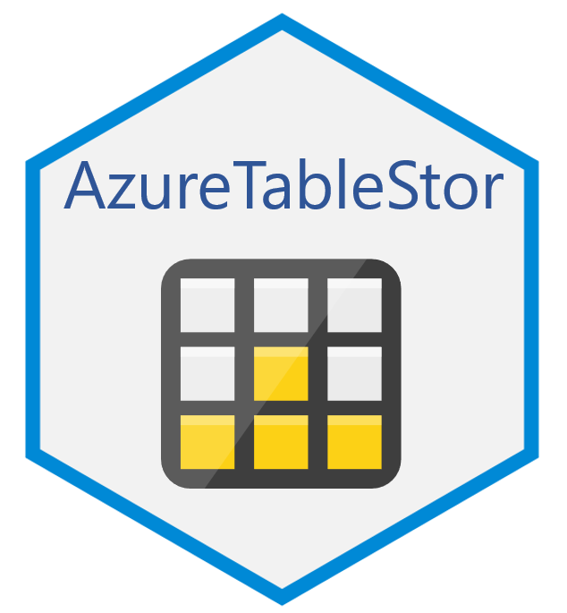

# AzureTableStor 

[](https://cran.r-project.org/package=AzureTableStor)


An R interface to the Azure table storage service, building on the functionality provided by [AzureStor](https://github.com/Azure/AzureStor).

Table storage is excellent for flexible datasets&mdash;web app user data, address books, device information, and other metadata&mdash;and lets you build cloud applications without locking down the data model to particular schemas. Because different rows in the same table can have a different structure&mdash;for example, order information in one row, and customer information in another&mdash;you can evolve your application and table schema without taking it offline. The table storage service is available both as part of general Azure storage, and as an optional API in Azure Cosmos DB.

The primary repo for this package is at https://github.com/Azure/AzureTableStor; please submit issues and PRs there. It is also mirrored at the Cloudyr org at https://github.com/cloudyr/AzureTableStor. You can install the development version of the package with `devtools::install_github("Azure/AzureTableStor")`.

## Example

```r
library(AzureTableStor)

# storage account endpoint
endp <- table_endpoint("https://mystorageacct.table.core.windows.net", key="mykey")
# Cosmos DB w/table API endpoint
endp <- table_endpoint("https://mycosmosdb.table.cosmos.azure.com:443", key="mykey")

create_storage_table(endp, "mytable")
list_storage_tables(endp)
tab <- storage_table(endp, "mytable")

insert_table_entity(tab, list(
    RowKey="row1",
    PartitionKey="partition1",
    firstname="Bill",
    lastname="Gates"
))

get_table_entity(tab, "row1", "partition1")

# specifying the entity as JSON text instead of a list
update_table_entity(tab,
'{
    "RowKey": "row1",
    "PartitionKey": "partition1",
    "firstname": "Satya",
    "lastname": "Nadella
}')

# we can import to the same table as above: table storage doesn't enforce a schema
import_table_entities(tab, mtcars,
    row_key=row.names(mtcars),
    partition_key=as.character(mtcars$cyl))

list_table_entities(tab)
list_table_entities(tab, filter="firstname eq 'Satya'")
list_table_entities(tab, filter="RowKey eq 'Toyota Corolla'")
```

---
<p align="center"><a href="https://github.com/Azure/AzureR"></a></p>
